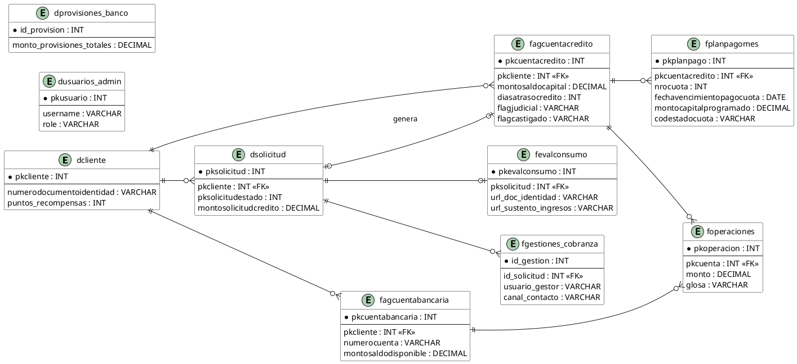

# Diagrama 1: Modelo de Entidad-Relación (ERD) - Consistencia y Datos Calibrados

**Propósito:** Demuestra la integridad referencial, el aislamiento de credenciales administrativas en `dusuarios_admin`, la persistencia de URLs en `fevalconsumo` y la trazabilidad de gestiones en `fgestiones_cobranza`.

