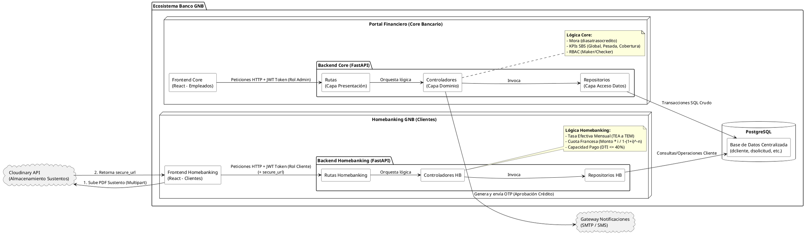

# Diagrama 2: Diagrama de Componentes - Arquitectura Limpia por Capas

**Propósito:** Muestra el flujo unidireccional y desacoplado, donde los controladores orquestan la lógica y los repositorios ejecutan SQL crudo sin ORM, garantizando velocidad en el Core.

