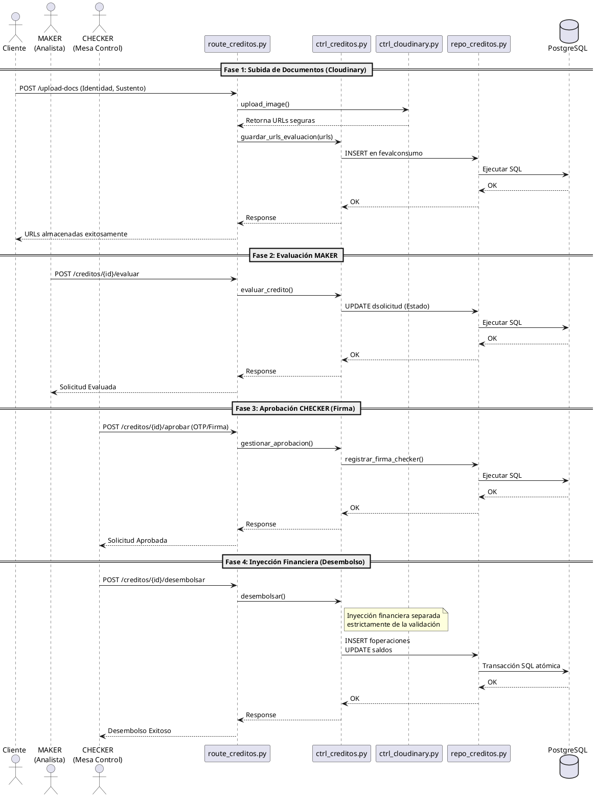

# Diagrama 3: Diagrama de Secuencia - Flujo Maker-Checker, Cloudinary y OTP

**Propósito:** Detalla la secuencia temporal y síncrona, aislando la inyección financiera del balance de las fases de validación previas.

