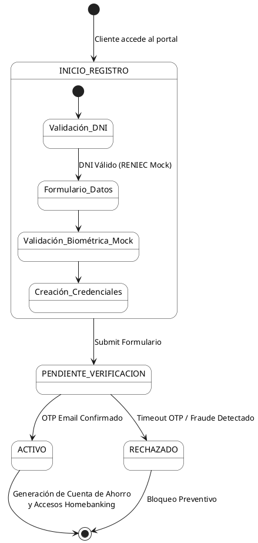

# Diagrama 4: Diagrama de Estados - Ciclo de Vida del Onboarding Digital GNB

**Propósito:** Representa la máquina de estados por la que transita la identidad digital del cliente y sus credenciales antes de ser activas en el Core Bancario.

