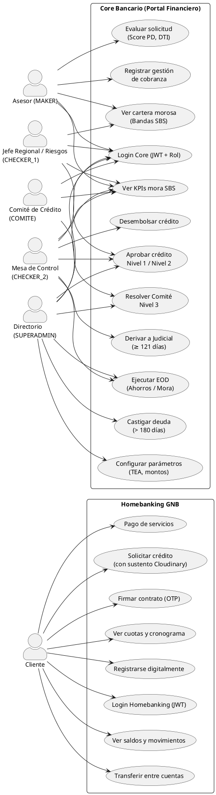

# Diagrama 5: Diagrama de Casos de Uso — Sistema Completo Banco GNB

**Propósito:** Muestra todos los actores del sistema y las funcionalidades que cada uno puede ejecutar, evidenciando la separación de responsabilidades por rol.

