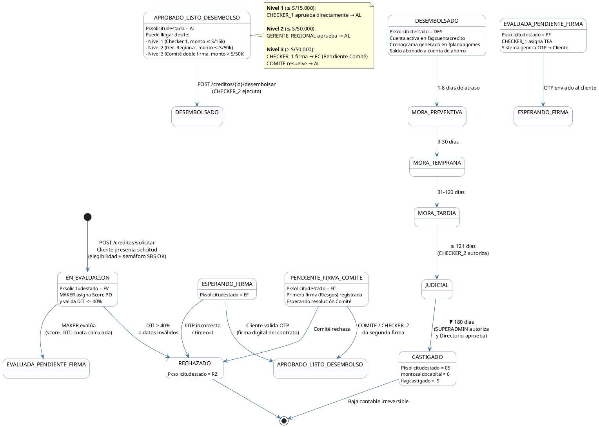

# Diagrama 6: Diagrama de Estados — Ciclo de Vida de una Solicitud de Crédito

**Propósito:** Documenta todas las transiciones posibles de una solicitud desde su creación hasta el desembolso, rechazo o paso al módulo de mora, incluyendo los estados intermedios de la ruta de aprobación por niveles (Maker-Checker).

