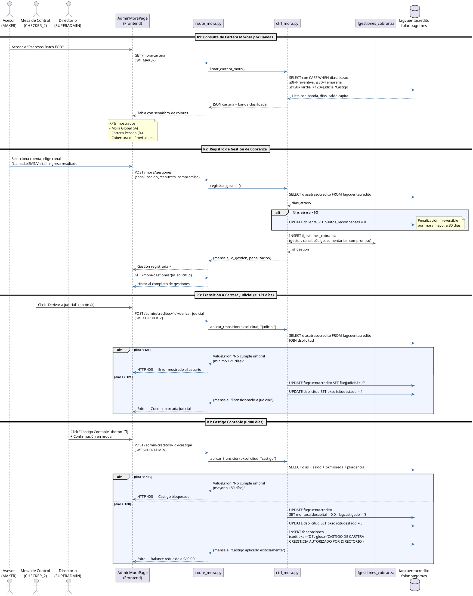

# Diagrama 7: Diagrama de Secuencia — Módulo de Mora R1·R2·R3

**Propósito:** Detalla la secuencia temporal del flujo de recuperaciones: desde la consulta de cartera morosa (R1), el registro de gestiones de cobranza (R2), hasta las transiciones de estado irreversibles a Judicial y Castigo (R3), con las validaciones de umbrales y permisos en cada paso.

