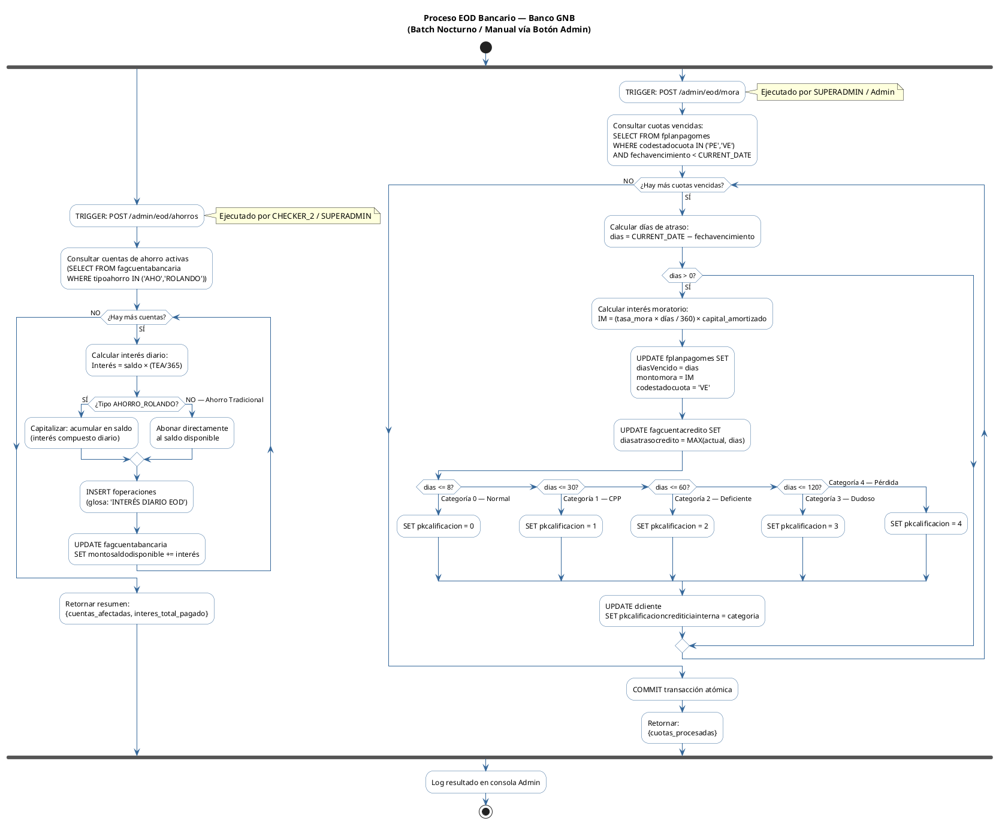

# Diagrama 8: Diagrama de Actividad — Proceso EOD (End of Day) Bancario

**Propósito:** Muestra el flujo de actividades del proceso batch nocturno en sus dos variantes: EOD Ahorros (capitalización de intereses pasivos) y EOD Créditos/Mora (penalización de cuotas vencidas y actualización de categorías SBS).

