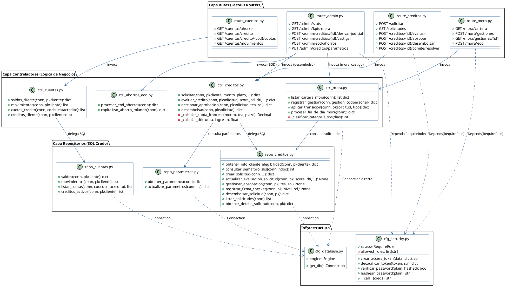

# Diagrama 9: Diagrama de Clases — Capa de Repositorios y Controladores

**Propósito:** Representa la arquitectura interna del backend (Python/FastAPI) mostrando la estructura de clases, métodos principales y dependencias entre la capa de controladores y la capa de repositorios, evidenciando el patrón de diseño sin ORM (SQL crudo con SQLAlchemy Core).

