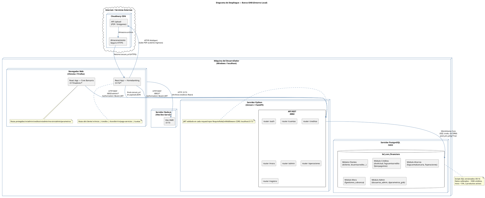

# Diagrama 10: Diagrama de Despliegue — Infraestructura del Sistema

**Propósito:** Muestra la topología física y lógica del entorno de ejecución: los nodos donde corren los servicios, sus puertos, protocolos de comunicación y la integración con servicios externos (Cloudinary), reflejando la arquitectura real del proyecto en desarrollo local.

